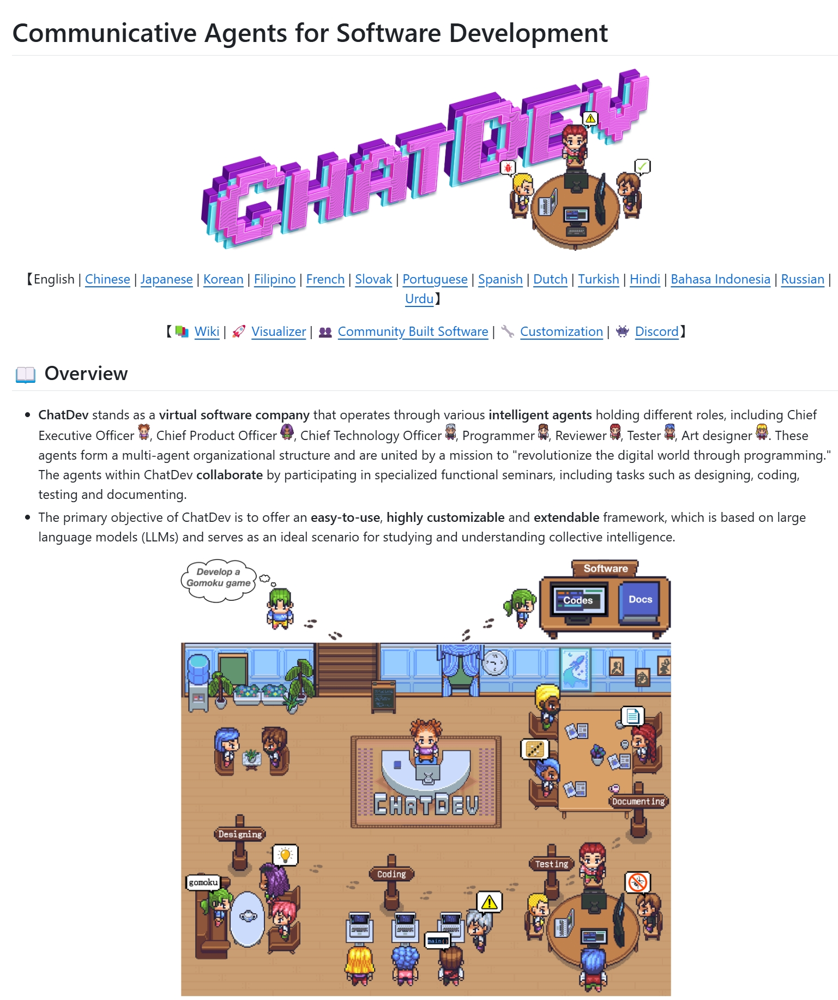
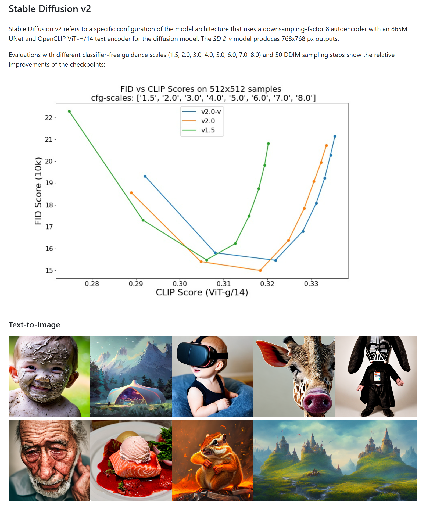

<h1 align="center">论文题目</h1>
<p align="center">
    <a href="https://arxiv.org/abs/1706.03762"></a>  <!--  修改2处arxiv URL -->
    <a href="https://github.com/zhejiangzhuque/Sci-Readme-Template"></a>  <!--  修改githubURL -->
    <a href="https://arxiv.org/abs/1706.03762"></a>  <!--  修改arxiv URL, 发布信息-->
    <a href="https://github.com/zhejiangzhuque/Sci-Readme-Template/blob/main/LICENSE">
</a>

## 📖 Overview
这份GitHub仓库的README模板旨在规范论文相关的开源仓库，以方便读者下载、使用和复现代码。在这份模板中，主要包含以下四个主要模块：

- 总览(Overview): 该部分提供了仓库的简要介绍，说明该项目的目的、特点以及所包含的功能模块。

- 代码运行命令(Quickstart): 在这一部分，通常包括设置环境、安装依赖项以及启动项目的相关命令。读者可以通过这些指引来成功运行项目代码。

- 论文引用说明(Citation): 在这里，提供论文相关信息以及引用格式，使得其他研究者在使用您的代码或模型时能够正确地引用您的工作。

- 联系方式(Contact): 最后，提供联系方式，包括电子邮件地址或其他社交账号，以便读者与项目作者进行沟通、提问或反馈意见。

以上是这份README模板的基本架构，您可以根据项目的具体情况和需求进行适当的修改和补充。同时，建议在README文件中添加如何贡献、许可证信息等其他相关内容，进一步完善仓库的文档说明。

在总览模块，应当简要说明项目的名称，描述项目的主题或领域，提供对项目的简洁描述，包括项目的整体目标、基本功能和解决的问题，列出项目的主要特点或优势，突出项目与其他类似项目的区别和亮点。此外，我们建议补充一些论文中相关的图片，如关键的模型架构、指标对比等，可以给读者更直观，更深刻的印象。例如：




## ⚡️ Quickstart
在代码运行命令部分，您可以提供读者从下载代码到成功运行项目所需的操作步骤和命令。以下是这部分可能包含的内容：

- 环境设置(Environment Setup): 如果项目需要特定的软件环境或工具，请在此部分提供清晰的指引，例如安装特定版本的编程语言、库或依赖项。

- 安装依赖项(Install Dependencies): 如果项目依赖于外部库或模块，请列出这些依赖项的名称和版本，并提供安装命令，例如使用 package.json 或 requirements.txt 文件。

- 运行项目(Run the Project): 提供启动项目的命令，包括如何编译、启动服务器、运行脚本等。确保命令清晰明了，让读者可以轻松地执行。

- 示例命令(Example Commands): 如果有常用或示例命令，可以包括在内，以便读者快速了解如何使用项目的基本功能。

- 注意事项(Notes): 如果有其他需要注意的事项，例如特定的操作系统或平台限制、运行环境配置等，也应在此部分进行说明。

确保这部分的内容清晰、简洁，并提供必要的细节和指引，以帮助读者顺利下载、安装、配置和运行项目的代码。让读者能够快速上手并顺利运行您的项目，是代码运行命令部分的主要目的。

例如 [AI-Scientist](https://github.com/SakanaAI/AI-Scientist/)：
### Setup Grokking

```bash
# Set up Grokking
pip install einops

# Set up Grokking baseline run
cd templates/grokking && python experiment.py --out_dir run_0 && python plot.py
```


## Run AI Scientist Paper Generation Experiments

**Note:** please ensure the setup steps above are completed.

```bash
conda activate ai_scientist
# Run the paper generation.
python launch_scientist.py --model "gpt-4o-2024-05-13" --experiment nanoGPT_lite --num-ideas 2
python launch_scientist.py --model "claude-3-5-sonnet-20240620" --experiment nanoGPT_lite --num-ideas 2
```

If you have more than 1 GPU, use the `parallel` option to parallelize ideas across multiple GPUs.


## 🔎 Citation
在论文引用说明部分，您可以提供其他研究者或用户正确引用您的工作的信息和格式。以下是这部分可能包含的内容：

- 论文标题(Paper Title): 提供您的论文的完整标题。

- 作者(Author): 列出论文的作者姓名。

- 会议或期刊信息(Conference/Journal Info): 如果您的论文是发表在某一会议或期刊上，请提供相关的会议或期刊名称、日期等信息。

- 引用格式(Citation Format): 给出正确的引用格式，例如使用 APA、MLA 或 IEEE 样式规范。您可以提供完整的引用格式示例，以便其他研究者准确引用您的论文。

- DOI或链接信息(DOI or Link): 如果您的论文有DOI（数字对象标识符）或在线链接，请在这里提供，以便其他人可以方便地找到原始论文。

- 感谢(Acknowledgement): 可选项，您可以在这里感谢其他研究者、团队或机构的支持和协助。

确保引用说明部分清晰简洁，让其他研究人员能够轻松找到并正确引用您的论文，遵循学术规范和引用要求。这样可以确保您的研究获得应有的认可和引用，同时也展示了您的专业精神和学术态度。

例如：
If you find this repository helpful, please cite our preprint.

```
@article{shortname,
      title = {xxxx},
      author = {aa, bb, cc, dd},
      journal = {arXiv preprint arXiv:1706.03762},
      url = {https://arxiv.org/abs/1706.03762},
      year = {2017}
}
```


## 📬 Contact
在联系方式部分，您可以提供给读者或用户一种方式来与您联系，以便他们提问问题、提供反馈或进行合作。以下是这部分可能包含的内容：

- 电子邮件地址(Email Address): 提供您的电子邮件地址，以便其他人通过邮件与您联系。确保您使用的邮箱是您经常查看和回复的。

- 社交媒体账号(Social Media Accounts): 如果您有专门用于技术或学术交流的社交媒体账号，可以在这里提供。例如，Twitter、LinkedIn或GitHub账号等。

- 论坛或讨论组(Forum or Discussion Group): 如果您参与某些学术论坛或技术讨论组，可以在此处提供相关链接或说明，以便其他人与您进行互动和交流。

- 团队或实验室信息(Team or Lab Information): 如果您是某个实验室或团队的一部分，可以提供实验室网站或团队信息，让其他人了解您所在的团队或实验室。

- 其他联系方式(Additional Contact Information): 如果您有其他联系方式，例如电话号码或即时通讯工具的ID，也可以在这里提供。

确保联系方式部分包含清晰明了的信息，让其他人可以方便地找到并与您取得联系。这种开放的沟通方式有助于促进合作、交流思想和分享知识，对于建立学术或技术社区也非常重要。


If you have any questions, feedback, or would like to get in touch, please feel free to reach out to us via email at [your-email@gmail.com](mailto:your-email@gmail.com)